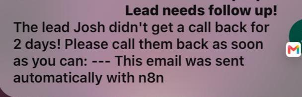

# Lead Management System

A small B2B company gets leads through a contact form. Without fast, smart handling, the good ones go cold while the team wastes time on the ones that were never going to convert. This system fixes that, end to end, automatically.

The moment a lead submits the form, it is read by an AI, scored by how valuable the opportunity is, answered with a personalized reply, and logged. Hot leads alert the sales team instantly. And every day, a scheduled workflow chases any lead that has gone quiet, so nothing slips through the cracks.

Built in n8n for a fictional company, FlowBridge, a B2B workflow automation and software integration business. Powered by OpenAI, Google Sheets, and Gmail.

---

## The Problem

Leads arrive as messy, free text messages. A human has to read each one, judge how serious it is, reply, and remember to follow up. On a busy week, good leads wait too long and go cold, and time gets spent on leads that were never a real opportunity.

FlowBridge wanted this handled automatically: capture every lead the moment it arrives, understand and score it, respond fast and personally, alert the team to the hot ones, keep everything in one place, and never let a lead go stale without a follow-up.

---

## The System

The system is built as two workflows that share a single Google Sheet as their source of truth. They are kept separate on purpose, because they run on completely different triggers.

---

### Workflow 1: Intake and Response

This workflow runs the instant a new lead submits the form. It scores, replies, routes, and logs, all in one pass.

It breaks into three stages:

**Lead intake and AI scoring.** A new lead submits the FlowBridge form, where Name, Email, Phone, and Request are required and Company Name is optional. An AI agent reads the free text request and classifies the lead as Hot, Warm, or Cold based on intent, seriousness, budget hints, urgency, and the size of the opportunity. It also returns a short reason for its score and writes a personalized reply tailored to what the lead actually asked for.

**Parse and auto reply.** A Code node parses the AI output (priority, reason, and reply) into clean fields the workflow can use. The personalized reply is then emailed to the lead automatically, so every lead gets a fast, relevant response.

**Enrich, alert, and log.** Hot leads trigger an instant email alert to the B2B sales team so they can act immediately. Each lead is enriched with a More Info field and then logged to a Google Sheet with all of its details, its priority, the reason, and a status, as the single source of truth.

---

### Workflow 2: Scheduled Follow-up

This workflow runs on a daily schedule, completely independent of new leads.

It reads every lead from the sheet and uses an IF node to find leads that are still marked New after more than 2 days. Those overdue leads trigger a follow-up email so none is forgotten.

It is a separate workflow with its own schedule trigger for an important reason: the intake workflow only fires when a new lead arrives, so a lead going stale on a quiet day would never be checked. A time based trigger solves this.

---

## Seeing It Work

### The Form

This is the live FlowBridge intake form a lead fills out.

---

### A Real Lead, Handled End to End

Here a lead named Josh submitted an urgent, high value request: "I need my company's sales process to be automated ASAP."

The AI scored him **Hot**, with the reason that he showed strong intent and urgency for automating his entire sales process, indicating a sizable opportunity. The lead was logged to the sheet with every field populated: his details, the priority, the AI's reason, the enrichment, a status of New, and the date received.

This is the payoff: a messy free text request turned into a scored, explained, logged, and answered lead, with the sales team alerted, all without anyone lifting a finger.

---

### The Workflows Running

Both workflows executing successfully, end to end.

---

### Real Email Notifications

The system does not just process data, it sends real emails. Here are the actual notifications received on my phone: one alerting the team that a new lead has arrived, and one flagging a lead that needs follow-up.

---

## Design Decisions

- **Two workflows, two triggers.** Intake is event driven (it reacts to each new lead). Follow-up is time driven (it runs on a daily schedule). These are different jobs with different triggers, so they are built as separate workflows that hand off through the shared sheet.
- **The hot lead alert lives in the intake flow.** A hot lead must reach the sales team the moment it arrives, not in tomorrow's batch, so that alert is part of the real time intake, not the scheduled workflow.
- **The original lead data is kept clean.** The AI returns only its judgment (priority, reason, reply). The original form fields are carried through the workflow itself rather than being retyped by the AI, so nothing important can be altered.
- **Enrichment is built to scale.** For this demo the More Info field is populated locally. In a production setup, this is exactly where a company lookup or enrichment API would slot in, without changing the rest of the system.
- **Status changes that need a human stay manual.** The system sets the states it can detect (New on arrival, overdue on the follow-up check). Statuses that depend on a real action, like marking a lead Contacted after a phone call, are updated by the team, because only they know that happened.

---

## Features I Used

- **n8n Cloud:** the workflow engine and the AI agent framework
- **n8n Form Trigger:** a live web form to capture leads
- **OpenAI:** scoring each lead and writing personalized replies
- **JavaScript (Code node):** parsing the AI output into clean fields
- **Google Sheets:** the single source of truth for all leads
- **Gmail:** auto replies to leads, alerts to the sales team, and follow-up emails
- **Schedule Trigger:** the daily, time based follow-up workflow
- **IF nodes and routing:** sending hot leads to the team and finding overdue leads
- **Date and time logic:** converting and comparing dates to detect stale leads

---

## Try It Yourself

You can import and run this system in your own n8n:

1. Download the two workflow files from the `json-files` folder.
2. In your own n8n, import each one (Workflows, then import from file).
3. Connect your own credentials: an OpenAI account, a Google Sheets account, and a Gmail account.
4. Create a Google Sheet with these columns: Name, Company Name, Email, Request, Phone Number, priority, reason, More Info, Status, Date Received.
5. Open the form trigger to get your form link, submit a test lead, and watch it flow through.

There is no live public link to interact with, since that would mean keeping my own form, workflows, and credentials running publicly. Importing the workflows lets you run the whole system on your own setup.

---

## Files

- `json-files/` the two workflows: the real time intake (AutomatedLeadAgent) and the scheduled follow-up (LeadAlerts)
- `canvas screenshots/sticky-notes/` the labeled workflow canvases
- `canvas screenshots/successful-executions/` the form, successful runs, and a real lead logged in the sheet
- `mail-notification-screenshots/` the real email notifications received on my phone

*Note: API keys and credentials have been removed from the exported workflows. To run this yourself, connect your own OpenAI, Google Sheets, and Gmail credentials in n8n.*
